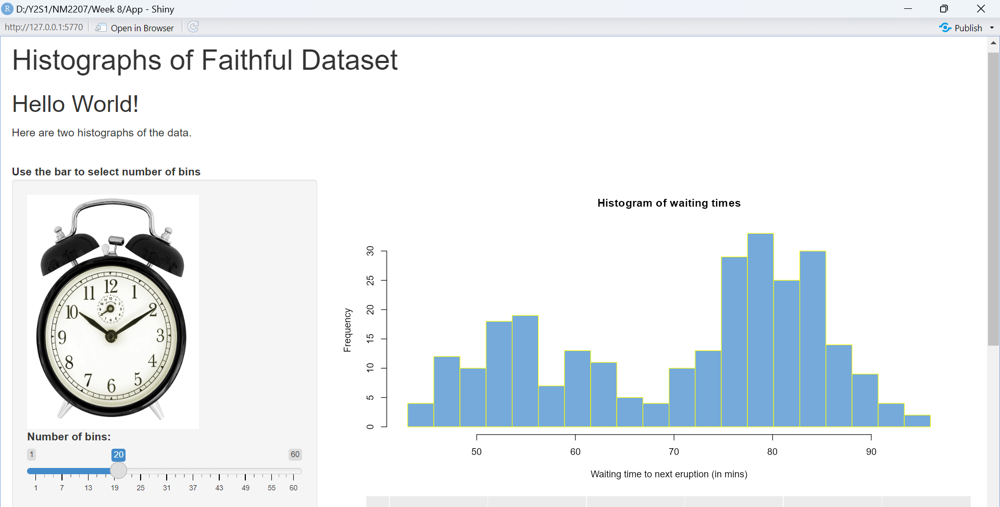
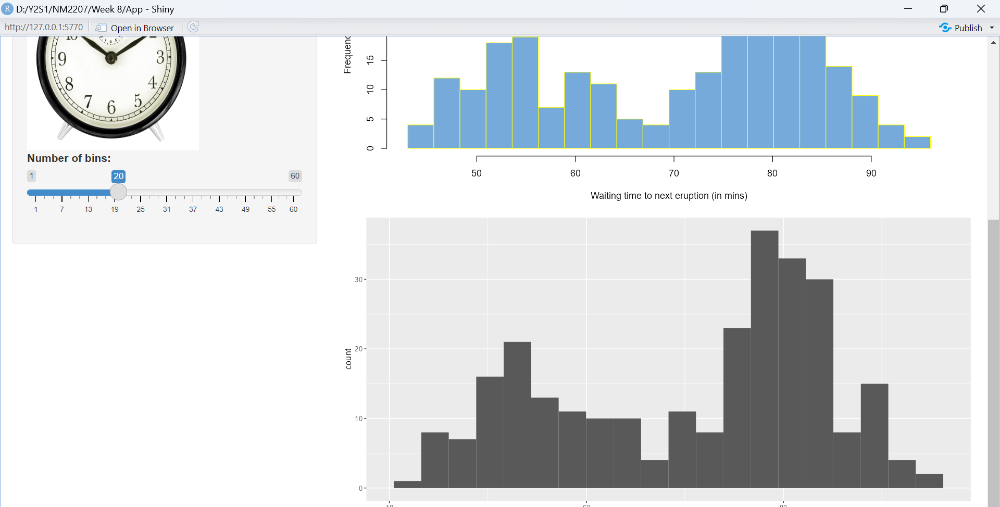
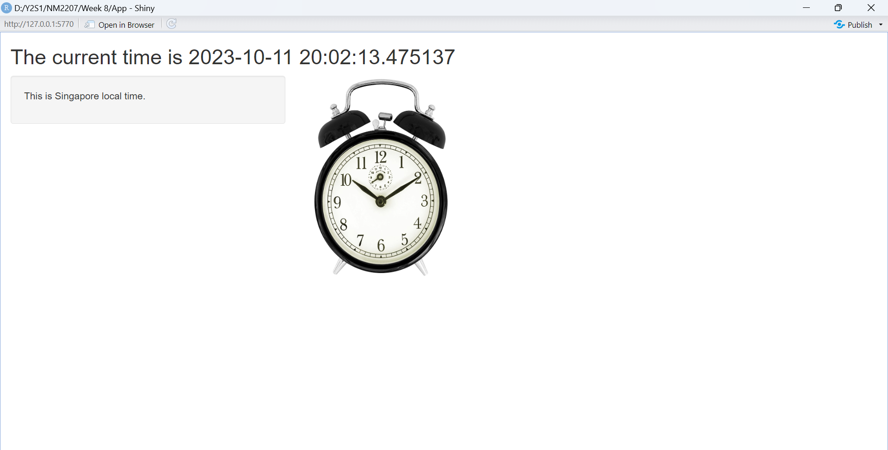

```{r, out.height= "400px",out.width= "1000px",echo=FALSE,eval=TRUE,fig.cap="This is App-1"}
 
```
```{r, out.height= "400px",out.width= "1000px",echo=FALSE,eval=TRUE,fig.cap="This is App-1"}
 
```
```{r, out.height= "400px",out.width= "1000px",echo=FALSE,eval=TRUE,fig.cap="This is App-2"}
 
```